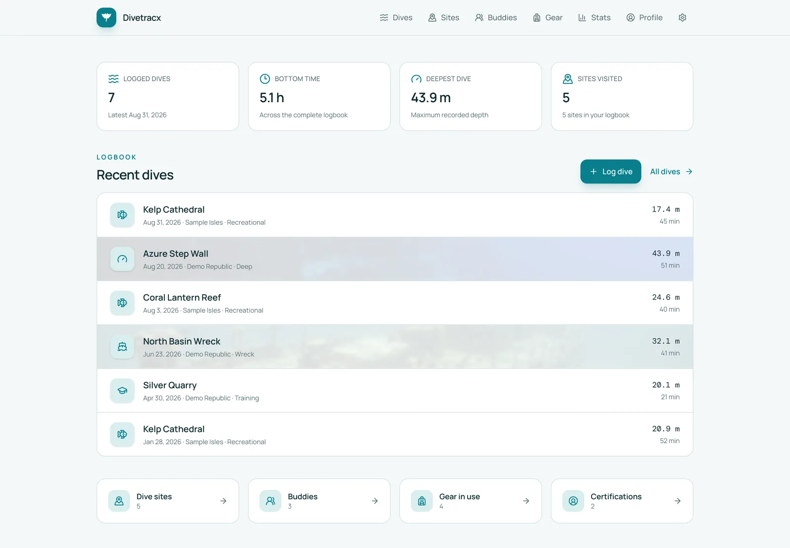
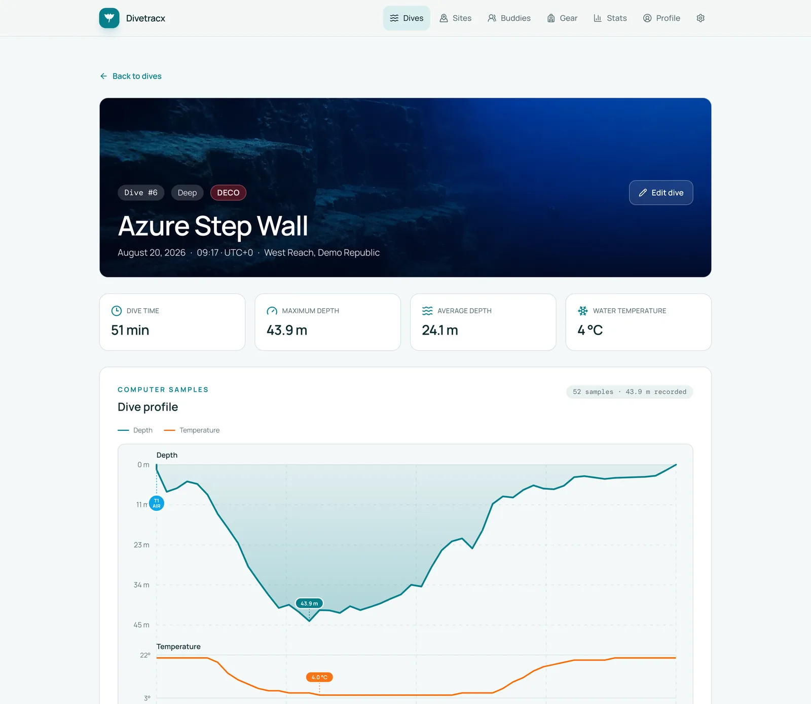
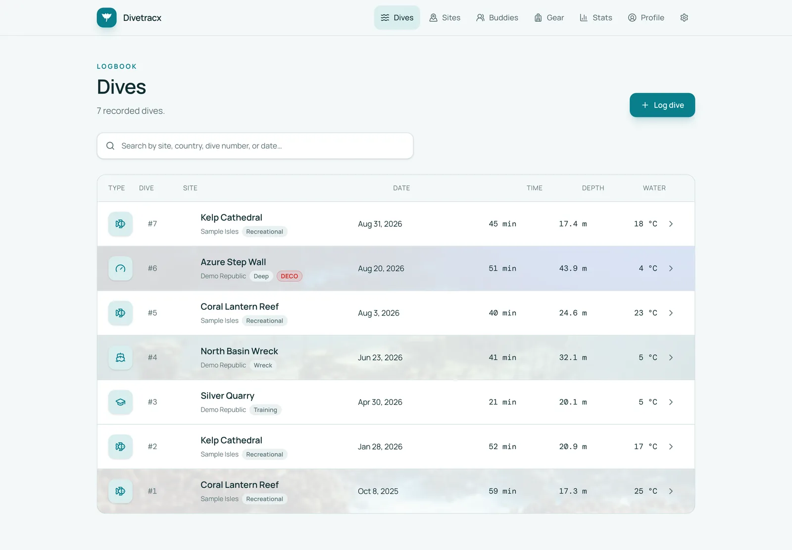
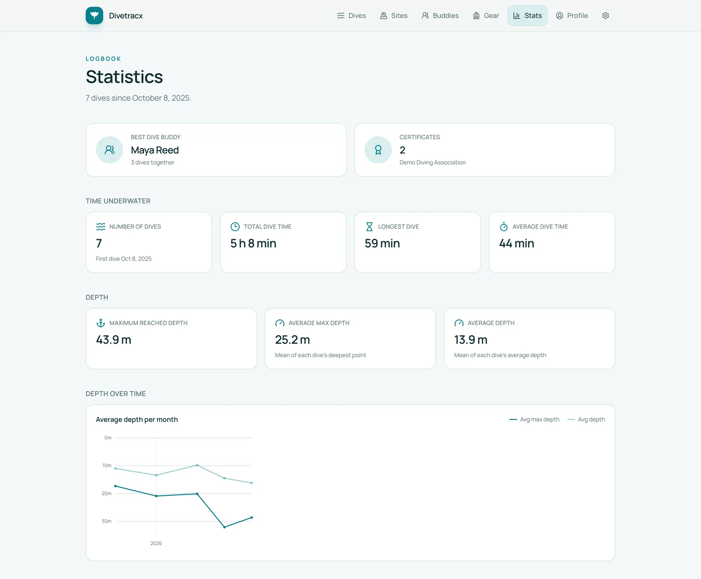
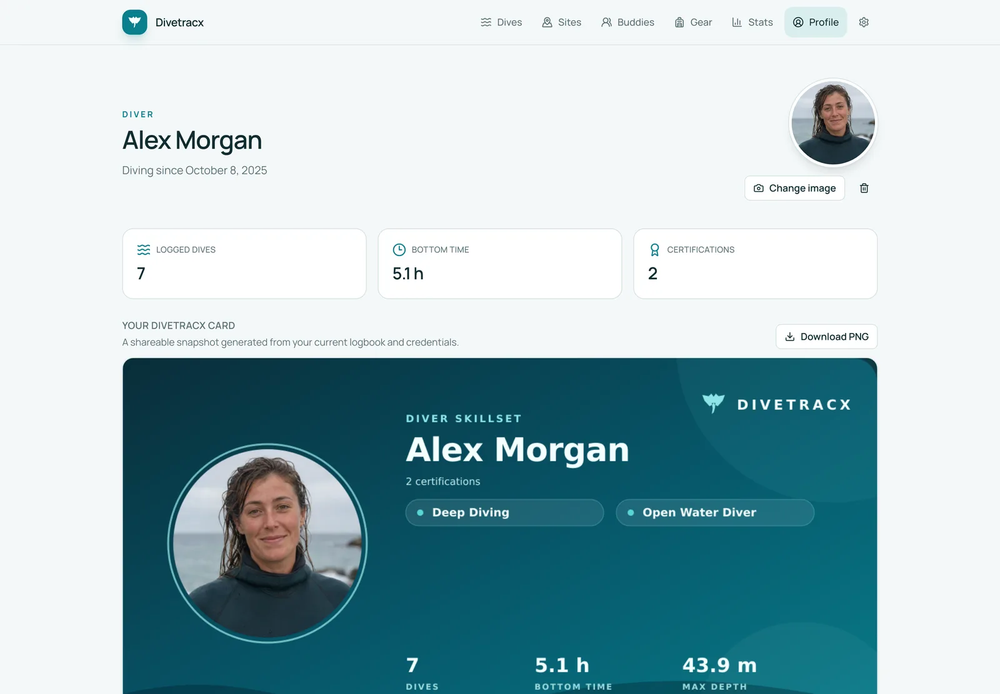
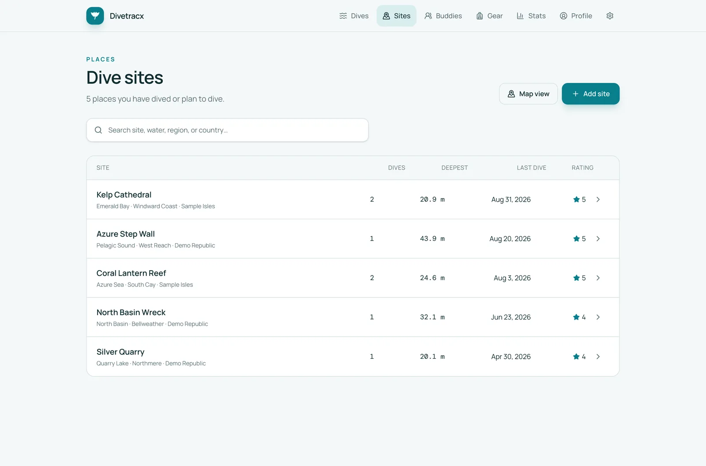

<!-- markdownlint-disable MD033 -->
<h1 align="center">
  <br>
  Divetracx
</h1>

<p align="center">
  <strong>The self-hosted dive log you actually own.</strong><br>
  Import from DiveMate and Garmin, log by hand, export anywhere. Keep every
  dive on your own infrastructure.
</p>

<p align="center">
  <a href="https://divetracx.vercel.app/"><b>Live demo</b></a>
  &nbsp;·&nbsp;
  <a href="#-getting-dives-in">Import</a>
  &nbsp;·&nbsp;
  <a href="#-getting-dives-out">Export</a>
  &nbsp;·&nbsp;
  <a href="#-quick-start">Quick start</a>
  &nbsp;·&nbsp;
  <a href="#-documentation">Documentation</a>
</p>

<p align="center">
<a href="https://github.com/michidk/divetracx/actions/workflows/ci.yml">
</a>


</p>

---

> [!TIP]
> **Try it in ten seconds.** The
> [read-only demo](https://divetracx.vercel.app/) runs entirely from seven
> anonymized sample dives with complete profiles — no account, no database,
> nothing to install.



## 🤿 What it is

Divetracx is a self-hosted home for your dives, sites, buddies, equipment,
cylinders, gases, profiles, pictures, and certifications.

Dive computers, phone apps, and exchange formats each keep their own copy of
your dives, with their own schemas and their own gaps. Divetracx pulls them
together into **one canonical logbook**: run a full historical import once,
then let incremental syncs pick up new dives — or skip the import entirely and
log dives straight from the UI. Either way the data lives on your own
PostgreSQL and storage, and you can export it again in the format of your
choice.

## ✨ Why Divetracx

- 📥 **Import from multiple sources.** DiveMate `.ddb` backups (with photos and
  certification cards) and Garmin dive computers via the official FIT SDK.
- 🔁 **Reliable ongoing sync.** Full imports are manual, validated, and
  transactional. Incremental imports skip unchanged records and never delete a
  dive just because it disappeared from a later feed.
- ✍️ **Log anything by hand.** Dives, tanks, sites, buddies, gear, and
  certifications have full editors in the UI. No dive computer required.
- 🧩 **One canonical record.** Different source schemas map into one durable
  model with full provenance. Vendor IDs and raw payloads stay in a separate
  integration layer, so your manual edits survive every re-import.
- 📈 **Complete dive detail.** Profiles, tanks, gases, pressure, temperature,
  decompression ceiling, ppO₂, notes, ratings, and media in one place.
- 🗺️ **Maps and statistics.** Interactive profiles, a site map with a
  click-to-pin coordinate picker, calendar activity, trends, personal records,
  and aggregate statistics.
- 📤 **Your data, portable.** Export to DiveMate `.ddb`, UDDF 3.2.3, CSV, or
  versioned Divetracx JSON at any time.
- 🤖 **Ask your agent.** An optional OAuth-protected MCP endpoint with
  owner-controlled read, write, and delete tools
  lets your own AI tools search dives, load details, list sites, and read
  statistics.
- 🔒 **Yours, end to end.** Self-hosted on your own PostgreSQL and your own
  storage, behind your own auth proxy. No accounts, no telemetry, no upsell.
- 🚀 **Deploys in one command.** Docker Compose for a home server, a Helm chart
  for a cluster.

## 📥 Getting dives in

Two import sources are supported today. Both are configured and run from
**Settings → Integrations**, and both can also run from the command line or on
a schedule. Every run lands in **Import history**, which reports discovered,
new, changed, unchanged, and failed source records.

| Source | Full import | Incremental sync | What comes across | How it connects |
| --- | :---: | :---: | --- | --- |
| **DiveMate** `.ddb` | ✅ | ✅ | Dives, profiles, tanks, sites, buddies, equipment, equipment sets, certifications with card images, shops, dive types, diver profile, pictures | Reads `DiveMate.ddb` plus its `Media` and `Cards` files from a Google Drive folder via a service account |
| **Garmin** dive computers | ✅ | ✅ | Dives, profiles, tanks, gases | The bundled Garmin Connect adapter signs in with your account (MFA supported) and pulls FIT activities |

> [!NOTE]
> **Not yet supported:** uploading a file from the browser, and importing UDDF,
> CSV, or Divetracx JSON. Those three formats are export-only for now. If your
> dives live elsewhere, log them by hand or bring them through a DiveMate
> backup.

**Full** and **incremental** mean different things:

- A **full import** is a deliberate, manual operation. It re-reads the whole
  source, validates it, and applies the result in a single transaction. It is
  destructive by design for records the source previously produced, but it
  never touches dives you created by hand or that only matched an imported
  profile.
- An **incremental import** is safe to run as often as you like. It compares
  stable source identities and content hashes, applies only new or changed
  records, and never deletes anything.

<details>
<summary><b>DiveMate details</b></summary>

Configure `DIVEMATE_GOOGLE_DRIVE_FOLDER_ID` and `GOOGLE_APPLICATION_CREDENTIALS`
for a service account with read access to the Drive folder holding your
backup. The importer uses SQLite row IDs and content hashes for idempotent
incremental detection. Images are copied to configured storage with immutable
originals and generated WebP thumbnails.

DiveMate buddy IDs import as buddies. Its legacy free-text `Divemaster` value
imports as a linked person with the Divemaster role. Divetracx exports
Divemaster, Instructor, and Guide assignments back into that field with role
labels, so those richer assignments survive a Divetracx → DiveMate → Divetracx
round trip.

```bash
bun run sync:divemate                              # incremental, from the CLI
bun run import:incremental --integration=divemate  # same thing, generic entry point
```

</details>

<details>
<summary><b>Garmin details</b></summary>

The app never talks to Garmin directly; it calls a fail-closed adapter that
Divetracx bundles (`bun run garmin:adapter`, or the `garmin` Compose profile).
Connect your Garmin account once from **Settings → Integrations**: credentials
are forwarded server-to-server, the adapter logs in (with MFA support) and
keeps only the resulting OAuth tokens on a persistent volume.

Activities are reconciled against existing log entries by start time within
45 minutes, so a computer-recorded profile attaches to the dive you already
logged instead of creating a duplicate.

```bash
bun run import:incremental --integration=garmin
```

</details>

## 📤 Getting dives out

Everything you put in, you can take out again. **Settings → Export** offers
one-click downloads, and the same files are served from `/api/export/*` for
scripts and backups.

| Format | Endpoint | Best for | What it contains |
| --- | --- | --- | --- |
| **DiveMate backup** `.ddb` | `/api/export/divemate` | Opening your whole logbook in DiveMate again | A DiveMate-compatible SQLite database rebuilt from canonical data, including Garmin-imported and hand-logged dives |
| **Divetracx backup** `.json` | `/api/export/json` | Complete, lossless backups | Every table in the database as versioned JSON (`divetracx-backup`, currently version 15) |
| **Dive spreadsheet** `.csv` | `/api/export/csv` | Spreadsheets and data analysis | One joined row per dive: site, buddies, equipment, tanks, conditions, notes, and the full profile as inline samples |
| **Universal dive log** `.uddf` | `/api/export/uddf` | Other logbook software | UDDF 3.2.3 with diver, sites, and dives including depth profiles |

The DiveMate export uses your configured `.ddb` only as a schema template and
rebuilds the supported tables from canonical data. Besides downloading it, you
can **publish it back to Google Drive** with *Export to Drive* on the
Integrations page. That replaces `DiveMate.ddb` in your Drive folder, asks for
confirmation, and is never triggered automatically; Drive keeps the previous
revision. The same export is available from the CLI:

```bash
bun run export:divemate --output=backups/DiveMate.ddb
```

> [!WARNING]
> Exports contain personal data — locations, health-related notes, contact
> details, certification numbers. Treat the files accordingly.

## ✍️ Logging dives by hand

You do not need a dive computer or a DiveMate history to use Divetracx. The UI
is a complete logbook editor, and hand-logged records live alongside imported
ones in the same canonical model.

- **Dives** — date, entry time, duration, surface interval, maximum and average
  depth, air and water temperature, weights, conditions (visibility, current,
  waves, weather), suit, boat, dive computer, shop, dive type, rating, and
  notes. Search for people and assign each one as Buddy, Divemaster,
  Instructor, or Guide; attach gear; and add one or more **tanks** with volume,
  start and end pressure, and O₂/He mix.
- **Dive sites** — name, water body, region, country, and notes, with a map
  where you click to pin the coordinates. Each site shows its dive count,
  deepest dive, and last visit.
- **Buddies** — the people you dive with, including their certifications and
  agency memberships.
- **Gear and gear sets** — track individual equipment items and group them
  into sets you can attach to a dive in one step.
- **Profile** — your diver profile, certifications, and agency memberships,
  plus a generated shareable diver card.
- **Photos** — upload pictures to dives, sites, and gear items; originals stay
  immutable and WebP thumbnails are generated.
- **Settings** — maintain your own lists of dive types and agencies.

Because provenance is stored separately from the logbook, re-running an import
never overwrites a field you edited yourself.

## 🤖 Ask your AI assistant

> [!NOTE]
> Set `MCP_SERVER_URL` and this turns on. Everything else works without it.

Divetracx exposes a scoped
[Model Context Protocol](https://modelcontextprotocol.io) endpoint so your own
AI tools can search and maintain dives, sites, buddies, gear, and your diver
profile. Every tool can be switched on or off under **Settings → AI access**.
Each connection then receives explicit `read`, `write`, and optional `delete`
scopes on the consent screen. Existing clients, their active scopes, immediate
revocation, and the last 100 authorization and tool events are managed in the
same page.

It ships its own OAuth 2.1 authorization server —
dynamic client registration, mandatory S256 PKCE, refresh-token rotation with
replay detection, hashed token storage, immediate revocation — and uses your
existing Hodor owner session for consent, so no external identity provider is
needed.

```bash
codex mcp add divetracx --url https://dives.example.com/api/mcp
codex mcp login divetracx
```

Tool results can contain private health, location, contact, and certification
data. Write tools use the same validation and canonical mutation services as
the web UI; delete tools are separately scoped and marked destructive. The
endpoint stays unavailable unless `MCP_SERVER_URL` is configured, and it can
then be paused without deleting clients from **Settings → AI access**.
Routing details are in [docs/deployment.md](docs/deployment.md#oauth-protected-mcp).

## 📸 Screenshots

<details>
<summary><b>More screenshots</b></summary>

<table>
  <tr>
    <td width="50%"></td>
    <td width="50%"></td>
  </tr>
  <tr>
    <td align="center"><sub>Dive detail with computer profile</sub></td>
    <td align="center"><sub>Searchable logbook</sub></td>
  </tr>
  <tr>
    <td></td>
    <td></td>
  </tr>
  <tr>
    <td align="center"><sub>Statistics</sub></td>
    <td align="center"><sub>Profile and shareable diver card</sub></td>
  </tr>
  <tr>
    <td colspan="2"></td>
  </tr>
  <tr>
    <td colspan="2" align="center"><sub>Dive sites</sub></td>
  </tr>
</table>

</details>

## 🧱 Tech stack

A modern, boring-where-it-counts TypeScript stack with full-stack type safety
from the database row to the rendered field:

| Layer | Choice |
| --- | --- |
| Runtime and package manager | Bun 1.4 |
| Full-stack framework | TanStack Start with server functions |
| Routing | TanStack Router, file-based and fully typed |
| UI | React 19, shadcn/ui, Base UI, Tailwind CSS v4 |
| Icons and maps | Lucide, MapLibre GL |
| Database | PostgreSQL 18 with Drizzle ORM and committed migrations; ephemeral PGlite for the demo |
| Media storage | Local filesystem or any S3-compatible bucket |
| Dive computer data | Garmin's official FIT JavaScript SDK |
| Validation | Zod at every boundary, including environment variables |
| Tooling | Vite, Biome, Knip, `bun test` |
| Deployment | Docker Compose or Helm, fronted by the Hodor auth proxy |

Server-only concerns — database access, storage providers, Google Drive and
Garmin transport, and secrets — never cross into browser code, and
configuration is validated lazily on first use, reporting the affected
variable names.

## 🚀 Quick start

Docker Compose starts PostgreSQL 18, applies committed migrations, starts
Divetracx, and exposes it through Hodor.

```bash
cp .env.example .env
# Replace HODOR_PASSWORD and HODOR_SECRET in .env.
# Generate a signing secret with: openssl rand -hex 32
docker compose up -d postgres
docker compose run --rm app bun run scripts/migrate.ts
docker compose up -d
```

Open <http://localhost:3000>, sign in through Hodor, and either start logging
dives or head to **Settings → Integrations** to connect DiveMate or Garmin.
Add `--profile garmin` to `docker compose up` to start the bundled Garmin
adapter.

## 🔧 Local development

Divetracx uses Bun 1.4.0. With PostgreSQL available at the `DATABASE_URL` from
`.env`:

```bash
bun install --frozen-lockfile
cp .env.example .env
docker compose up -d postgres
bun run db:migrate
bun run dev
```

The unauthenticated development server listens on <http://localhost:3000>. It
applies pending migrations before startup and watches for newly generated
migrations.

<details>
<summary><b>All available commands</b></summary>

| Command | Purpose |
| --- | --- |
| `bun run dev` | Apply migrations and start the watched development server |
| `bun run check` | Check source formatting and lint |
| `bun run typecheck` | Run TypeScript without emitting files |
| `bun run test` | Run tests; environment-gated integration suites are skipped |
| `bun run test:integration:imports` | Run the PostgreSQL-backed import integration tests |
| `bun run test:integration:divemate-export` | Run the DiveMate writeback integration tests |
| `bun run lint:deadcode` | Find unused code and dependencies with Knip |
| `bun run build` | Build production assets |
| `bun run build:demo` | Build the database-free Vercel demo |
| `bun run check:helm` | Lint and template the Helm chart |
| `bun run verify` | Run the complete local quality gate |
| `bun run db:generate` | Generate a Drizzle migration after a schema change |
| `bun run db:migrate` | Apply committed migrations |
| `bun run db:studio` | Open Drizzle Studio |
| `bun run db:seed` | Seed the same fictional dataset as the public demo |
| `bun run sync:divemate` | Run an incremental DiveMate import |
| `bun run import:incremental --integration=garmin` | Run an incremental Garmin import |
| `bun run export:divemate --output=backups/DiveMate.ddb` | Rebuild a DiveMate backup from canonical data |
| `bun run garmin:adapter` | Start the bundled Garmin Connect adapter |
| `bun run media:refresh-thumbnails` | Regenerate WebP thumbnails for stored pictures |

</details>

## 📚 Documentation

| Guide | What is inside |
| --- | --- |
| [Development and testing](docs/development.md) | Workflow, tests, tooling, CLI import and export |
| [Configuration reference](docs/configuration.md) | Every environment variable |
| [Deployment](docs/deployment.md) | Docker, Compose, Helm, MCP routing, security boundary |
| [Read-only demo mode](docs/demo-mode.md) | How the PGlite demo is built |
| [Design system](DESIGN.md) | Layout contract and UI conventions |
| [Helm chart reference](charts/README.md) | Chart values, Secrets, CronJobs |

## 📁 Project layout

```text
src/routes/                 TanStack Router file routes and API endpoints
src/components/             Shared application UI and shadcn/ui primitives
src/modules/                Domain modules: dives, sites, gear, export, media, profile, …
src/modules/mcp/            Scoped MCP tools, owner policy, and built-in OAuth 2.1 server
src/modules/integrations/   Generic import service, runs, and provenance
src/modules/divemate/       DiveMate .ddb reader, mapper, and writer
src/modules/garmin/         Garmin FIT mapping and adapter client
src/modules/garmin-adapter/ Bundled Garmin Connect adapter service
src/db/                     Drizzle schema and database connection
drizzle/                    Committed migrations and metadata
scripts/                    CLI entry points: migrate, seed, sync, export, adapter
charts/                     Helm chart
```

> [!WARNING]
> `src/routeTree.gen.ts` is generated. Run `bun run generate-routes` instead of
> editing it manually.

## 📄 License

[MIT](LICENSE)

---

<p align="center">
  Open-source software for people who care about their dives. 🌊<br>
  <sub><a href="https://divetracx.vercel.app/">Try the demo</a> ·
  <a href="https://github.com/michidk/divetracx">Star it on GitHub</a></sub>
</p>
